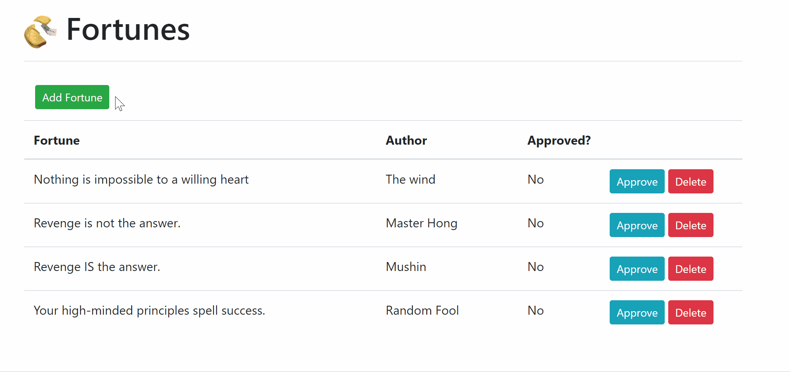
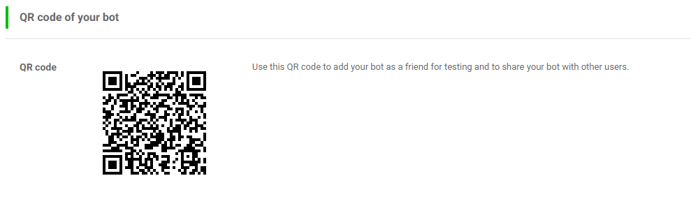

# Linebot



## Instructions to get started:

To get the project running, you will need to install these dependencies:

# Requirements

Python: 
* [Python 3.6+](https://www.python.org/downloads/)
* [pipenv](https://pipenv.readthedocs.io/)
* [Zappa](https://www.zappa.io/)

If you don't have pipenv then run this command:
```
$ pip install pipenv
```
Run this command in the root of the project folder:
```
$ pipenv shell
```
If you don't have Zappa installed in your virtual environment then run this command:
```
$ pip install zappa
```

Node:
* [Node](https://nodejs.org/en/download/)

# How to Run Locally

Run flask in one terminal run:

```
$ python src/app.py
```

And in another terminal run the client:

```
$ npm run dev
```

Now visit the page `http://localhost:8080/`

# How to run deploy through bothub

First install bothub-cli
```
$ pip install bothub-cli
```
Create the .bothub folder in C:\Users\User\
Be sure to get the needed credentials(config.yml) and put it in the .bothub folder
```
mkdir ~/.bothub
```
Open the project folder and navigate to the MyBot directory
```
cd MyBot
```

```
$ bothub deploy
```
Successfully deploying will allow you to add the bot by scanning this QR code

Message your new friend, "@Fortune Bot fortune!" to test it out

# Zappa

## How to deploy using Zappa

You can use the configuration file stored in this project to deploy to aws lambda

or

Zappa can automatically set up your deployment settings with the `init` command:
```
$ zappa init
```

After your configuration has been set you can deploy to aws with:
```
$ zappa deploy [environment]
```
_Replacing [environment] the correct environment you wish to deploy._ `dev` `production`

## How to update Zappa

If you want to update your zappa project on aws it's as simple as:
```
$ zappa update dev
```

## How to undeploy Zappa

If you want to undeploy your zappa project on aws use the command:
```
$ zappa undeploy dev
```
