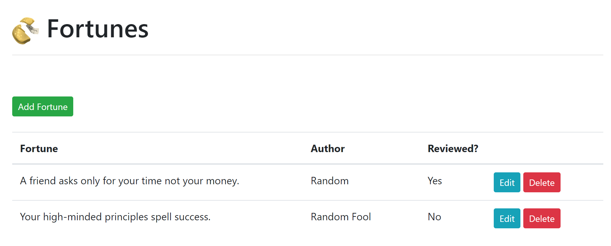

# Linebot



## Instructions to get started:

To get the project running, you will need to install these dependencies:

# Requirements

Python: 
* [Python 3.6+](https://www.python.org/downloads/)
* pipenv

If you don't have pipenv then run this command:
```
pip install pipenv
```
Run this command in the root of the project folder:
```
pipenv shell
```

Node:
* [Node](https://nodejs.org/en/download/)

# How to Run Locally

Run flask in one terminal run:

```
$ python src/app.py
```

And in another terminal run the client:

```
$ npm run dev
```

Now visit the page `http://localhost:8080/`

# How to run deploy through bothub

Bothub, a chatbot hosting service for developers

Create a [bothub](https://bothub.studio/) account

First install bothub-cli
```
$ pip install bothub-cli
```
Then you'll need to assign these values
```
$ bothub channel add line --channel-id=<channel id> \
                        --channel-secret=<channel secret> \
                       --channel-access-token=<channel access token>
```
Inside the MyBot directory run this command in powershell
```
$ bothub deploy
```
Your bot should be running now
